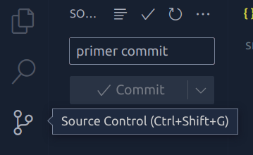
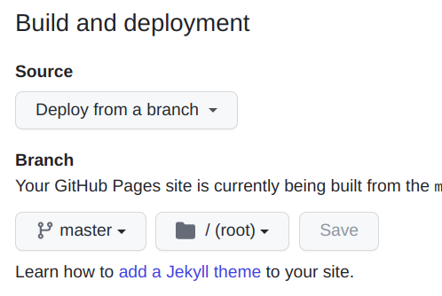

# Probando _Markdown Preview Enhanced_ 🛠️

[Markdown Preview Enhanced](https://shd101wyy.github.io/markdown-preview-enhanced/#/) es una extensión para Visual Studio Code que permite transformar archivos `.md` en archivos `.html`, lo cual facilita la creación de páginas de documentación, ya que escribir código [Markdown](https://www.markdownguide.org/getting-started/) es mucho más fácil y rápido que escribir HTML.

Lo único que hay que hacer es crear un archivo `.md` como éste, abrirlo con la opción _Open Preview To The Side_ dentro de la _Command Palette_ de VS Code. Ahí se abre una ventana a la derecha con una preview del archivo _markdown_ tal como se vería en un browser.

Luego, para convertirlo a HTML lo único que hay que hacer es darle click derecho sobre la preview y seleccionar la opción _HTML (cdn hosted)_. Ahí vamos a ver que se crea un archivo `.html` con la conversión:


Si abrimos ese archivo con [Live Server](https://ritwickdey.github.io/vscode-live-server/) podemos ver el resultado final 🎉️

## Ejemplos de código 💻️

Podemos usar _markdown_ para mostrar ejemplos de código en cualquier lenguaje. Todos los bloques de código declarados dentro de triples [backticks](https://wumbo.net/symbols/backtick/) se muestran automáticamente con [syntax highlighting](https://www.markdownguide.org/extended-syntax/#syntax-highlighting):

```js
const { floor, random } = Math;

// Fisher-Yates shuffle:
const shuffle = array => {
  array.forEach( (_, i, arr) => {
    let j = floor( random() * (i + 1) );
    [arr[i], arr[j]] = [arr[j], arr[i]]
  })
  return array
}
```


## Estilos de CSS 💅️

Además, _MPE_ permite darle estilos de CSS a nuestro _markdown_. En este ejemplo estoy usando CSS para importar un font de [Google Fonts](https://fonts.google.com/).

Para usar CSS dentro del _markdown_ hay que entrar nuevamente a la _Command Palette_ de VS Code y seleccionar _Customize CSS_.

Ahí se va a abrir una pestaña dentro de VS Code con el archivo `style.less`. Dentro de ese archivo vamos a ver una clase de CSS (o, mejor dicho, de [Less](https://lesscss.org/)) llamada `.markdown-preview.markdown-preview`. Dentro de esta clase podemos agregar los estilos que querramos y se van a ver reflejados en la preview:

```css
.markdown-preview.markdown-preview {
  /* modify your style here */
}
```

Por ejemplo, para cambiar los fonts y los colores:

```css
@import url('https://fonts.googleapis.com/css2?family=Ysabeau:ital@0;1&display=swap');

.markdown-preview.markdown-preview {
  font-family: 'Ysabeau', sans-serif;
  background-color: rgb(240, 239, 241);
}
```

## Videos

También es posible insertar videos:

<video width="600" controls preload="none">
  <source src="./assets/ejemplo-leble.webm" type="video/webm">
</video>

<video width="600" controls preload="none">
  <source src="./assets/ejemplo-quijote.webm" type="video/webm">
</video>

## Crear una página en GitHub Pages 📝️ 

Luego de generar el archivo HTML podemos inicializar un repositiorio usando _Source Control_ de VS CODE y hacer un _commit_ a GitHub:



Luego, en el repositorio en GitHub, entramos a _Settings, Pages_ y seleccionamos _Deploy from a branch_ con la rama _master_:



Le dan _Save_ y luego de unos segundos le dan _refresh_ al browser y van a ver un cartel con el siguiente mensaje:

==Your site is live at https://usuario.github.io/repositorio==

Y listo, ya tienen su página online 🥳️

## Sintaxis Markdown 👨‍💻️

La sintaxis markdown permite crear fácilmente elementos como [tablas](https://www.markdownguide.org/extended-syntax/#tables):

| Columna 1   | Columna 2    |
| ----------- | -----------  |
| Fila 1      | Contenido 1  |
| Fila 2      | Contenido 2  |

O [listas de tareas](https://www.markdownguide.org/extended-syntax/#task-lists)

- [x] Aprender a usar Markdown
- [x] Instalar Markdown Preview Enhanced
- [ ] Crear página en GitHub Pages

Y muchas cosas más 🙂️


